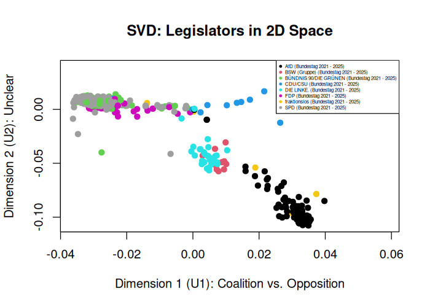

# Scaling the 20th German Bundestag: Uncovering Latent Dimensions in Legislators' Votes

In this project, three idealpoint estimation approaches - a baseline SVD, its double-centered counterpart, and a Bayesian one-dimensional 2-PL IRT model — are applied to roll-call data of the 20th German Bundestag, the Ampel period in which SPD, Bündnis 90/Die Grünen, and the FDP formed a three-party reigning coalition from September 2021 until its collapse in March 2025. This analysis revealed latent structure in the underlying geometry, namely, a division along institutional roles in legislator's voting behaviors: those who are coalition-leaning versus those who are opposition-supporting.

## Outline

The main analysis is structured as follows:

- Data Preprocessing
- Uncentered SVD
- SVD with Double-Centered Data Matrix
- Bayesian One-Dimensional 2-PL IRT Model
- Substantive Evaluation

The three data files (see folder `data`), a replication file in R Markdown (`scaling_analysis.Rmd`) and further supplementary materials (`figures`) are provided in this repository.

## Project Summary and Evaluation

The following report summarizes the tasks carried out in this project and gives a potential interpretation of the results found.

### I. Data Preprocessing

To begin with, I inspected the two dataframes and recoded both DIE LINKE fractions into one coherent group. Next, I rearranged the vote dataframe (`df_votes`) into a wide matrix with legislators in the rows and votes (0 = no, 1 = yes, NA = anything else) in the columns. After that, double-mean imputation was used to fill in missing values. This was done by substituting each missing value with the mean of the observed values in its row plus the mean of the observed values in its column minus the overall mean of the observed data:

$`x_{ij}^{imp} = \bar{x}_{i\cdot} + \bar{x}_{\cdot j} - \bar{x}_{\cdot\cdot}`$

### II. Singular Value Decomposition (Uncentered)

First, I performed singular value decomposition (SVD) for the un-centered, wide-format matrix. Looking at the first two dimensions of legislators, it is very clear that the first dimension has substantial meaning as coalition parties fall on one side and the opposition parties on the other, with the CDU/CSU as one of the biggest German parties somewhere in the middle. Hence, this ordering very much makes sense and has face validity, given my knowledge of German politics (see Figure 1).

    
**Figure 1:** SVD for Uncentered Data

The extreme votes are classified by the first right-singular vector value for a vote which essentially reveals how much that particular vote loads onto the first underlying dimension extracted by the SVD (here: coalition-support vs. opposition). A large absolute value (close to 1) indicates that a vote is highly polarizing or discriminative along the first dimension, meaning it strongly separates legislators on the coalition party side from those on the opposition side. A small `v1_value` (close to 0) means the vote is less informative for that dimension, hence it does not separate legislators much along the first axis. Examples for this are routine votes or unanimous decisions.      
The most extreme votes in this case are concerned with multiple policy areas such as gender-based violence and protection against it, armed military deployment in Sudan, suicide-prevention and immigration. The magnitudes of the values undermine the interpretation of the first underlying legislator dimension as coalition-supportive legislators versus opposition-leaning legislators as there is a clear divide in their voting structures that cannot be attributed to a specific political issue (i.e. left-right economic divide, immigration or similar). The least extreme votes all have values very close to zero which means they do not have a strong discriminative influence and are almost neutral. Since several of these issues are proposals from DIE LINKE or specific protest- or critique-styled motions, these are highly partisan and ideologically salient proposals and therefore it makes sense that they are not decisive for the basic coalition-support dimension. Instead they push legislators along secondary or noisy dimensions.      
In short: the SVD is capturing that the stark coalition-support vs. opposition line is drawn by core, salient policy and security‑type votes, while ideologically vivid but narrower or symbolic motions contribute little to that first axis.

When looking at the second dimension of legislators, I cannot make out a meaningful dimension. The vertical axis shows no broad or interpretable divide like the first axis does and is therefore most likely residual variation (noise) after the main coalition-support versus opposition pattern has already been extracted.

Comparing the variance explained by the first and second dimension undermines all the aforementioned interpretations: The first dimension (coalition vs. opposition) explains most of the variation in the roll-call matrix (83.6 percent), suggesting that the German Bundestag voting during this period is largely organized around a single coalition-versus-opposition axis. The second dimension adds only a limited amount of explanatory power (10.1 percentage points), underlining that it likely captures weaker secondary structure that does not look easy to label substantively from the plot alone, or noise rather than a major independent political cleavage.

### III. Singular Value Decomposition (Double-Centered)

Second, I **repeated all these steps for the double-centered matrix**. As rows and columns of the modified matrix have mean zero, this transformation was successful.

The results from the SVD with the doubled-centered matrix suggest that the data is still dominated by a main political axis along coalition-support versus opposition-leaning legislators, though the structure is less clean than in the un-centered case. 

     
**Figure 2:** SVD for Double-Centered Data Matrix

The roll calls most responsible for that pattern, meaning the most extreme or discriminative votes, include politically salient and highly divisive items such as the energy efficiency laws and immigration policies. Furthermore, the least extreme votes (armed forces deployment, the WHO and minimum wage) have values near zero, hence they are close to neutral in terms of the main structure. This has face validity, though less than the un-centered version, based on my knowledge of the German Bundestag.

The second legislator dimension may capture a foreign-policy or security-related divide (possibly around support for Ukraine or NATO) or Covid-19 policy strategies (based on the least and most extreme votes in this dimension as well as face validity), but this appears weaker and more issue-specific than the main coalition versus opposition axis.

The variance metrics support this interpretation as well as the comparison to the first approach: The first dimension explains 60.3 percent of the variance which is substantial but less dominant than in the un-centered analysis. It suggests that the matrix is not purely one-dimensional. Adding the second dimension raises the explained share to 76.5 percent, meaning the second axis adds meaningful structure, but still much less than the first. Hence, here the second dimension is likely not just noise, but still clearly secondary to the first.

### IV. Bayesian Item Response Modeling (IRTM) / Scaling

I estimated a one-dimensional 2-PL IRT model on the long roll-call data, using weakly informative standard normal priors for the legislator ideal points, the roll-call locations as well as the discrimination parameters. Furthermore, I fitted a binomial distribution with a `logit` link function to ensure positive values. 

")     
**Figure 3:** Ideal Point Posterior Distribution per Party (IRT Model)

The posterior distributions show a clear separation between government coalition legislators and opposition legislators when clustered into parties which agrees with the first SVD dimension from before. Moreover, the IRT model adds uncertainty estimates around each party's ideal point, making it possible to distinguish whether differences between parties in the 20th German Bundestag are clearly supported by the posterior or only weakly separated. In particular, some party's posterior intervals overlap substantially, meaning their ordering is uncertain even when their posterior means differ. This insight is the great benefit of Bayesian IRT over SVD: it not only enables the identification of latent structure in the data but also of uncertainty measures. Overall, in this case, the IRT results confirm the main coalition versus opposition axis found in the SVD.

### V. Evaluation of Substantive Claim: Coalition Versus Opposition Dimension in the 20th Bundestag

The first dimension of the 20th Bundestag separates coalition-leaning legislators from opposition-leaning legislators. The posterior ideal points per party support this claim: coalition parties cluster on one side of the latent scale, while opposition parties cluster on the other (see Figure 3). Additionally, the posterior distributions show that this separation is much clearer for the larger party blocs than for adjacent parties. For example, the posteriors for FDP, Greens and SPD overlap more than the posteriors for Left and BSW, suggesting the main divide is coalition alignment rather than a perfectly ordered left-right spectrum. Though, as the posterior intervals show that some between-party differences are small relative to uncertainty, the exact ordering of nearby parties should not be over-interpreted.

While, in my understanding, the interpretation on a party level is most important for this project, I want to use the following paragraphs for a glance on legislator posterior distributions pooled and per legislator. 

")     
**Figure 4:** Pooled Ideal Point Posterior Distribution (IRT Model)

To start with, one can analyze the posterior distribution of all legislator's ideal points pooled together (see Figure 4). The bimodal nature of this distribution underlines the interpretation of the first dimension as a meaningful division between legislators: the two spikes to the left and right indicate a divide in legislator's votes that is clustered into two groups, likely coalition-leaning legislators and opposition-supporting legislators. Importantly, though this is something that I infer based on face validity rather than somethings the posterior directly shows. Moreover, this posterior distribution is not necessarily substantively informative as it mixes across legislators and posterior uncertainty, meaning the bimodal nature might simply be driven my model identification and pooling and not a meaningful insight.      
On top of that, the pooled posterior distribution does not visualize any insight on how extreme or uncertain each individual legislator's position is. Though, this can be analyzed by looking at the ideal point distribution per legislator with their credible intervals (see figure `fig5_post_dist_ideal_points_per_legislator` in `images` folder). While this figure certainly lacks in precision and face validity due to the large amount of legislators (N = 722), it shows that many of them have posterior means near the middle (close to or at zero) and some are more extreme, with uncertainty varying by person. This individualized interpretation underlines the previous argument regarding the pooled posterior distribution.

While these insights are certainly interesting, the posterior distribution of ideal points per party remains the key insight from this analysis. It shows clear ideological clustering, with governing coalition parties and their legislators grouped on one side and opposition parties and their legislators on the other. Furthermore, it shows that this separation is not equally precise for every party, since some parties’ posterior distributions overlap more than others.     
More importantly, this per-party posterior distribution shows uncertainty, not just party averages: nearby parties may differ in posterior means, but their ordering is not always certain. Hence, the first dimension is strongly coalition versus opposition, but the exact ranking of some parties should be treated cautiously.

## Resources Used

What follows is an (almost certainly incomplete) list of resources I used to create the code and do the interpretations in this project.

- https://github.com/paul-buerkner/Bayesian-IRT-paper
- https://www.jstatsoft.org/article/view/v100i05
- https://www.youtube.com/watch?v=hwMqnZTa_h8
- https://bookdown.org/rdpeng/exdata/dimension-reduction.html
- https://genomicsclass.github.io/book/pages/pca_svd.html
- https://www.geeksforgeeks.org/data-science/singular-value-decomposition-svd/